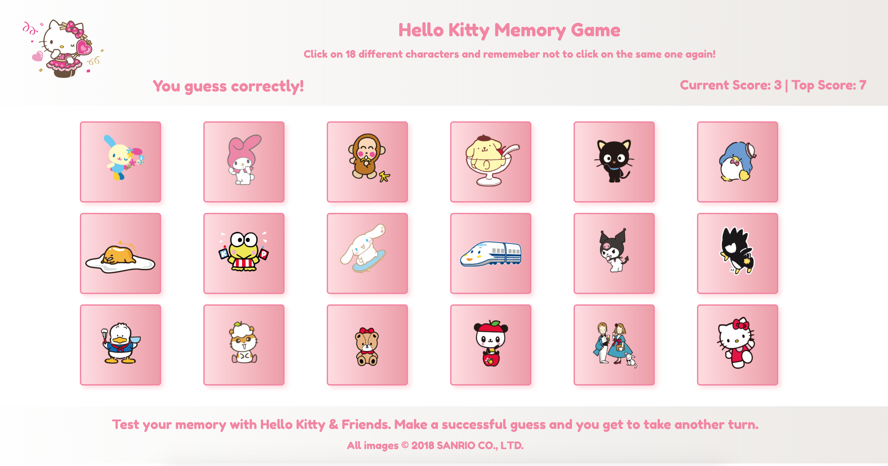

# Hello Kitty Memory Game

A memory game built with `React` for the user to test their memory with Hello Kitty and Friends.

---

A working version of the application can be found at [https://hellokitty-memorygame.herokuapp.com](https://hellokitty-memorygame.herokuapp.com "Hello Kitty Memory Game - React Clicky Game")

---

## Technologies used

- `React`

---
## How to Play:

Click on 18 different characters and rememeber not to click on the same one again. Make a successful guess and you get to take another turn!

## Game Logic

1. The application will render different character images to the screen. Each image wil listen for click events.
2. The application will keep track of the user's score. The user's score will be incremented when clicking an image for the first time. The user's score will be reset to 0 if they click the same image more than once.
3. Every time an image is clicked, the images rendered to the page will shuffle themselves in a random order.
4. Once the user's score is reset after an incorrect guess, the game will restart.

